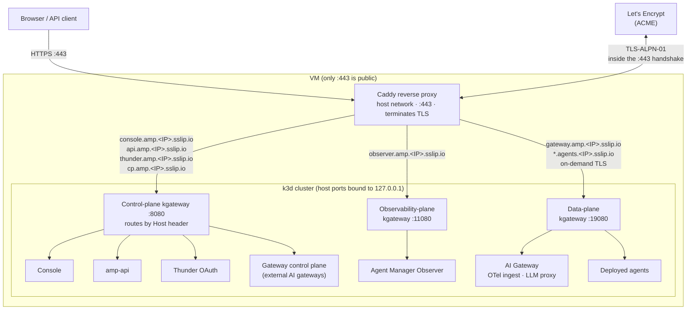
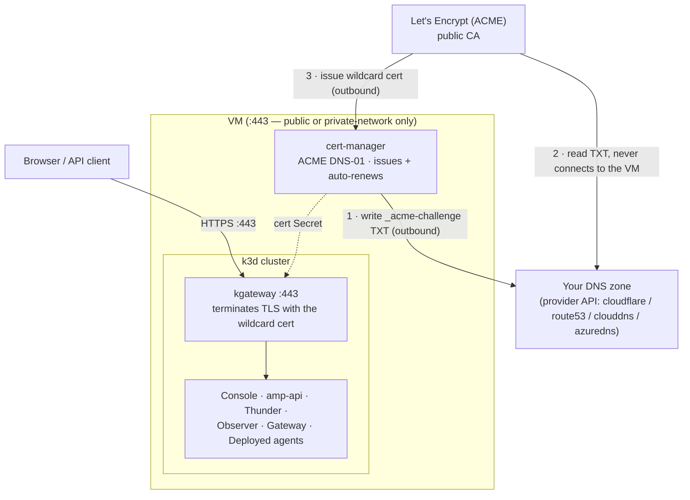

import Tabs from '@theme/Tabs';
import TabItem from '@theme/TabItem';

# Run Agent Manager on a VM with Docker

:::warning Not recommended for production use

Both installation paths on this page **Simple** and **Advanced** are intended for **evaluation, demos, and proof-of-concept** use only. Do not use them to run production workloads or to handle sensitive or regulated data.

For production, run Agent Manager on a properly operated Kubernetes platform with high availability, a managed and backed-up database, secret management, monitoring, and a hardened, redundant ingress following your organization's production practices. Use these installers to try Agent Manager out, not to run it for real.

:::

:::info Stronger agent isolation tiers
Agents run sandboxed under the standard **runc** runtime by default. Agent Manager also supports stronger per-environment isolation tiers — **gVisor** (userspace kernel) and **Kata Containers** (per-agent VM) — but they have hardware/OS requirements and need a dedicated node. For more information, see the [gVisor](../administration/isolation-tiers/gvisor.mdx) and [Kata Containers](../administration/isolation-tiers/kata.mdx) setup guides.
:::

Install Agent Manager on a Linux VM where Docker is the only host dependency. Pick the path that fits you:

- **Simple**: give the installer the VM's public IP and it does everything else: hostnames are derived from the IP via [sslip.io](https://sslip.io) and TLS certificates are issued automatically by Let's Encrypt. No domain, no DNS setup, no certificate handling. Best for demos and quick evaluations.
- **Advanced**: a config-file-driven installer for a **custom domain**, on a VM that is either publicly reachable or **private-network-only**. Choose how TLS is handled: automatic Let's Encrypt, the DNS-01 challenge for a private VM, your own certificate, a generated local CA, or a load balancer in front. Adds pre-flight validation of your config, certificates, and DNS.

<Tabs groupId="vm-installer">
<TabItem value="simple" label="Simple (IP + automatic TLS)" default>

The simple installer exposes the platform over HTTPS using [sslip.io](https://sslip.io) hostnames derived from the VM's public IP, so there's no domain registration and no client `/etc/hosts` edits.

## Prerequisites

You need an SSH client to log into the VM. On the VM itself, install the tools below **before** running the installer — it **verifies** they are present and exits with install hints if any are missing; it does **not** install host tooling for you. The whole stack runs on Docker: k3d runs the Kubernetes cluster as Docker containers, and Caddy runs as a container.

| Tool | Version | Purpose |
| --- | --- | --- |
| [Docker](https://docs.docker.com/engine/install/) | v26+ (8 GB RAM, 4 CPU) | Container runtime |
| [k3d](https://k3d.io/#installation) | v5.8+ | Local Kubernetes cluster |
| [kubectl](https://kubernetes.io/docs/tasks/tools/#kubectl) | v1.33+ | Kubernetes CLI |
| [Helm](https://helm.sh/docs/intro/install/) | v3.12+ | Package manager |

`curl` and `lsof` are also required — usually preinstalled, but on a minimal image install them with your OS package manager (for example `sudo apt-get install -y curl lsof`).

Verify everything is installed:

```bash
docker --version
k3d --version
kubectl version --client
helm version --short
```

Verify the Docker daemon is running:

```bash
docker info > /dev/null
```

The VM also needs:
- A **static (reserved) public IP** and SSH access (sudo). The install derives every hostname, TLS certificate, and OAuth issuer from the IP (`*.amp.<IP>.sslip.io`), so a **changing IP breaks the install**, and stopping the VM (for example to resize its disk) releases an ephemeral IP. Reserve the address before installing. If the IP ever changes, reinstall against the new IP.
- **At least 50 GB of disk.** Building and running agents pushes the in-cluster image store past 13 GB; on a smaller disk the node hits `DiskPressure`, which evicts pods and can take cluster DNS down mid-build.
- **Inbound `443/tcp` open** in the cloud security group / firewall, and only 443. Certificates issue via the TLS-ALPN-01 ACME challenge, which runs inside the `:443` TLS handshake, so no inbound port 80 is ever needed. The `:443` exposure must be **TCP passthrough** (not a TLS-terminating load balancer in front), since the challenge happens inside the handshake.

## Install

SSH into the VM and run the one-command installer with `sudo`. It downloads a single versioned install bundle (no repository clone) and runs from it:

```bash
# on the VM (Docker, k3d, kubectl, helm already installed)
curl -fsSL https://github.com/wso2/agent-manager/releases/download/amp/v0.0.0-dev/bootstrap.sh \
  | sudo bash -s -- simple \
      --host <VM_PUBLIC_IP> \
      --version 0.0.0-dev \
      --email you@example.com
```

Pass `--host` the VM's **public** IPv4 address. A cloud VM usually can't read its own public IP (it's NAT'd behind the address you used to SSH in), so the installer needs it to build the `*.amp.<IP>.sslip.io` hostnames.

The installer runs in two phases: preflight (verify the required tools + open the firewall) and the platform install + Caddy startup. Allow 8-15 minutes. It needs `sudo` because it opens the firewall and creates the cluster. Downloading one bundle instead of cloning the repo and fetching each file separately avoids the GitHub rate-limiting that can throttle a per-file install.

### Options

| Flag | Default | Purpose |
|---|---|---|
| `--host` | _(required)_ | The VM's public IPv4 address |
| `--version` | _(required)_ | Agent Manager release to install; an existing `amp/v*` [release](https://github.com/wso2/agent-manager/releases) (the `bootstrap.sh` URL embeds the same version) |
| `--email` | _(none)_ | ACME contact for expiry notices |
| `--no-external-gateways` | off | Drop the gateway control-plane endpoint if you won't connect external gateways |

## What gets exposed

The installer fronts the stack with [Caddy](https://caddyserver.com), an open-source web server that terminates TLS, obtains and renews Let's Encrypt certificates automatically, and reverse-proxies each public hostname to the right service. It runs as a single `amp-caddy` Docker container and is the only process listening on the internet-facing ports.

Only `:443` faces the internet; all other service ports are bound to the VM's loopback and reached only by Caddy.



Every public hostname resolves to the VM's IP (via sslip.io) and arrives at Caddy on `:443`; Caddy terminates TLS and reverse-proxies to the matching loopback port. The Agent Manager services are ClusterIP inside the cluster: Caddy forwards the console, API, Thunder, and gateway-control-plane hosts to the OpenChoreo control-plane kgateway (loopback `:8080`), the observer host to the observability-plane kgateway (loopback `:11080`), and the OTel-ingest host plus the deployed-agent wildcard to the data-plane kgateway (loopback `:19080`) — each gateway routes by the preserved `Host` header. Certificates are obtained over that same `:443` using the TLS-ALPN-01 challenge, so no inbound port 80 is needed. The deployed-agent wildcard gets its certificate on demand at first request.

| URL | Purpose |
|---|---|
| `https://console.amp.<IP>.sslip.io` | Console UI |
| `https://api.amp.<IP>.sslip.io` | Agent Manager API (used by `amctl`) |
| `https://thunder.amp.<IP>.sslip.io` | Thunder OAuth (login) |
| `https://observer.amp.<IP>.sslip.io` | Agent Manager Observer |
| `https://gateway.amp.<IP>.sslip.io/otel` | OTel trace ingest from deployed agents |
| `https://<org>-<project>.agents.<IP>.sslip.io/...` | Deployed-agent invocation endpoints (one wildcard host per org/project) |
| `https://cp.amp.<IP>.sslip.io` | Gateway control plane; connect external gateways here (on by default) |

## Log in

Open `https://console.amp.<IP>.sslip.io` and sign in with the seeded admin user **`admin`** (password **`admin`**). This user holds the `Agent Manager Admin` role, which grants full administrative permissions for both console and API access.

The **`admin`** account is provisioned with the `Agent Manager Admin` role during bootstrap, so API calls are authenticated and authorized. Use the same credentials for both console login and API access via Bearer token authentication.

## Deployed-agent invocation

When you deploy an agent, its endpoint is published on a per-project host `<org>-<project>.agents.<IP>.sslip.io` and routed by Caddy to the OpenChoreo data-plane gateway. Because these hostnames are dynamic (a new one per org/project), Caddy issues their TLS certificates **on demand** at the first request (via the same ACME challenge as the fixed hosts), rather than up front. Invocations are authenticated with a user token that the gateway validates against the public Thunder issuer.

Because issuance is on demand and uses TLS-ALPN-01 (the challenge runs inside the `:443` handshake), the **very first request to a newly-deployed agent host can fail with a one-time certificate error**, most visibly `ERR_CERTIFICATE_TRANSPARENCY_REQUIRED` in Chrome. That first connection is consumed by Caddy answering the ACME challenge, so the browser briefly sees the challenge certificate instead of the real one. Issuance completes within a second or two; reload the page (or open it in a fresh tab) and it serves the trusted Let's Encrypt certificate. This only affects the first hit per new agent host; the certificate is then cached in the `amp-caddy-data` volume.

amp-api advertises each agent endpoint with the `https://` scheme (the installer sets `tlsEnabled` on the service), so the console (and any other caller) invokes it over TLS directly through the wildcard site.

## TLS

Caddy obtains and auto-renews trusted Let's Encrypt certificates on first start, with no manual certificate steps. Issuance uses the **TLS-ALPN-01** challenge, which runs inside the `:443` TLS handshake, so only inbound 443 is ever required and there is no port-80 dependency. Certificates and the ACME account persist in the `amp-caddy-data` Docker volume, so restarts do not re-request them.

Because the challenge happens inside the TLS handshake, the public `:443` must reach Caddy as **raw TCP**; do not put a TLS-terminating load balancer in front of the VM. There is no `:80` listener, so plain `http://` URLs are not served (no automatic http→https redirect); always use the `https://` URLs the installer prints.

## Persistence and teardown

Application data (PostgreSQL), issued certificates, and the k3d cluster persist across Docker/host restarts via named volumes. To tear down completely, delete the cluster, then remove the Caddy front door and its volumes (which hold the issued certificates and ACME account):

```bash
cd agent-manager/deployments/quick-start
sudo ./uninstall.sh --delete-cluster                    # delete the k3d cluster (workloads + app data)
sudo docker rm -f amp-caddy                              # remove the Caddy front door
sudo docker volume rm amp-caddy-data amp-caddy-config    # drop the cached certs + ACME account
```

Use `sudo`; the installer runs Docker and k3d as root. Plain `./uninstall.sh` (without `--delete-cluster`) only removes the Helm releases and leaves the cluster running; `uninstall.sh` does not touch the Caddy container or its volumes, so remove those separately as shown.

## Connect an external gateway

Agent Manager can drive external WSO2 AI gateways. The control-plane endpoint `https://cp.amp.<IP>.sslip.io` is exposed by default for this. In the console, open **Infrastructure → Gateways**, generate a registration token, and follow the generated commands, which point the gateway at `cp.amp.<IP>.sslip.io:443`, where it opens a control WebSocket and pulls its configuration. If you do not need external gateways, install with `--no-external-gateways` to drop this endpoint.

**Security:** the registration token grants a gateway your LLM-provider API keys and proxy credentials. Treat it as a secret, revoke/regenerate it from the Gateways page when a gateway is decommissioned, and optionally restrict `cp.amp...` to known gateway source IPs at the firewall.

## Troubleshooting

- **Certificates never issue / hosts unreachable from outside.** Open inbound `:443` in your cloud security group / NACL, and make sure the public `:443` reaches the VM as **raw TCP**: a TLS-terminating load balancer in front breaks the TLS-ALPN-01 challenge. The installer can't verify external reachability from inside the VM, so this surfaces as Caddy failing to obtain certificates (`docker logs amp-caddy`).
- **Certificate not issued.** Check `docker logs amp-caddy`. Let's Encrypt rate limits on sslip.io are high but not infinite; if hit, retry shortly.
- **Login redirect mismatch.** Confirm you reached the console via its `console.amp.<IP>.sslip.io` URL, not the raw IP.
- **Certificate error on first agent invocation** (`ERR_CERTIFICATE_TRANSPARENCY_REQUIRED` or similar): the per-agent certificate is issued on demand, and the first request races with that issuance. Reload the page after a second or two; it only happens once per new agent host (see [Deployed-agent invocation](#deployed-agent-invocation)).

</TabItem>
<TabItem value="advanced" label="Advanced">

The advanced installer (`install-advanced.sh`) is config-file driven and runs **on the VM** with `sudo`. Use it when you have your own domain. It issues **publicly-trusted certificates** via cert-manager's ACME **DNS-01** challenge and terminates TLS on `:443` at the in-cluster gateway (no Caddy). Because DNS-01 validates by writing a DNS TXT record rather than by connecting to the VM, the same flow works whether the VM is **public** or reachable only from a **private network** — issuance needs outbound access only.

If you just want a quick IP-based demo with automatic TLS, prefer the **Simple** tab.

## Prerequisites {#adv-prerequisites}

- **Docker, k3d, kubectl, Helm, curl, and `lsof`** must already be installed on the VM. The installer **verifies** they are present and exits with install hints if any are missing — it does **not** install them for you.
- A **Linux VM** with at least **4 vCPUs**, **8 GB RAM**, and **50 GB of disk**, and **outbound** internet access (to pull images/charts and reach the ACME + DNS-provider APIs). Inbound `:443` is needed only for clients to reach the services — **not** for certificate issuance — so a fully private VM works.
- **A domain you control**, hosted on one of the supported DNS providers: **Cloudflare**, **AWS Route 53**, **Google Cloud DNS**, or **Azure DNS**.
- **A DNS-provider API credential** scoped to edit that zone's records. cert-manager uses it to write the `_acme-challenge` TXT record; you do **not** create TXT records by hand.

## Configure {#adv-configure}

The config file is plain shell. Fetch the bootstrap script and create an `amp-config.env` from the keys below (the installer's `--init` also emits an annotated template):

```bash
# on the VM
curl -fsSL https://github.com/wso2/agent-manager/releases/download/amp/v0.0.0-dev/bootstrap.sh -o bootstrap.sh
```

| Key | Required | Purpose |
|---|---|---|
| `AMP_VERSION` | yes | Agent Manager release to install (an `amp/v*` [release](https://github.com/wso2/agent-manager/releases)) |
| `DOMAIN_BASE` | yes | Base domain; service hosts are derived as `<svc>.<DOMAIN_BASE>` |
| `ACME_EMAIL` | yes | ACME account contact; cert-manager registers the account with it |
| `DNS_PROVIDER` | yes | `cloudflare`, `route53`, `clouddns`, or `azuredns`; supply that provider's credentials below |
| `ACME_SERVER` | no | Override the ACME directory (e.g. Let's Encrypt **staging**) while testing, to avoid rate limits |
| `EXTERNAL_GATEWAYS` | no | `true` (default) exposes the `cp` endpoint for external data-plane gateways |
| `HOST_CONSOLE`, `HOST_API`, `HOST_THUNDER`, `HOST_OBSERVER`, `HOST_GATEWAY`, `HOST_CP` | no | Override an individual service hostname (default `<svc>.<DOMAIN_BASE>`) |
| `AGENTS_BASE` | no | Base for deployed-agent hostnames (default `agents.<DOMAIN_BASE>`) |

With `DOMAIN_BASE=amp.mycompany.com`, the derived hosts are `console.amp.mycompany.com`, `api.amp.mycompany.com`, `thunder.amp.mycompany.com`, `observer.amp.mycompany.com`, `gateway.amp.mycompany.com`, `cp.amp.mycompany.com`, and deployed agents at `<org>-<project>.agents.amp.mycompany.com`. cert-manager issues one **wildcard** certificate covering all of these (including the deployed-agent and env-Thunder tiers), so there are no per-host certificate steps.

### DNS provider credentials {#adv-dns-provider}

Add the block for your provider to `amp-config.env`. Only the credential is secret; keep the file `chmod 600`.

Cloudflare (a scoped **Zone → DNS → Edit** API token):

```sh
DNS_PROVIDER=cloudflare
CLOUDFLARE_API_TOKEN=<token>
```

AWS Route 53 (IAM access key with `route53:ChangeResourceRecordSets` on the zone):

```sh
DNS_PROVIDER=route53
AWS_ACCESS_KEY_ID=<access-key-id>
AWS_SECRET_ACCESS_KEY=<secret-access-key>
AWS_REGION=us-east-1
```

Google Cloud DNS (service-account key file readable on the VM):

```sh
DNS_PROVIDER=clouddns
GCP_PROJECT=my-gcp-project
GCP_SERVICE_ACCOUNT_FILE=/opt/amp/gcp-dns-sa.json
```

Azure DNS (service principal):

```sh
DNS_PROVIDER=azuredns
AZURE_TENANT_ID=<tenant-id>
AZURE_CLIENT_ID=<client-id>
AZURE_CLIENT_SECRET=<client-secret>
AZURE_SUBSCRIPTION_ID=<subscription-id>
AZURE_RESOURCE_GROUP=<zone-resource-group>
```

### DNS records {#adv-dns-records}

Certificate issuance itself needs **no A records** — cert-manager proves control by writing the `_acme-challenge` TXT record via your provider credential. You only need A records so clients can **reach** the services: point the service hosts (and the two wildcards below) at the VM's IP — the **public** IP for a public VM, or the **private** IP for a private VM (a public zone may hold a private A record; split-horizon is fine).

```
*.amp.mycompany.com          A  <VM_IP>   # console/api/thunder/observer/gateway/cp
*.agents.amp.mycompany.com   A  <VM_IP>   # deployed agents (one level deeper)
```

## How TLS works {#adv-tls}

cert-manager (installed in the cluster) runs the ACME DNS-01 challenge, issues a wildcard certificate into a Kubernetes Secret, and auto-renews it. The OpenChoreo kgateway terminates TLS on `:443` using that Secret and routes each hostname to the right service. There is no Caddy container and no host-side ACME client.



## Install {#adv-install}

Validate and preview without touching the cluster first:

```bash
sudo bash bootstrap.sh advanced --config amp-config.env --dry-run
```

This loads the config, runs the advisory DNS check, and prints the derived hosts, helm overrides, and the cert-manager resources it will apply. When it looks right, run the real install:

```bash
sudo bash bootstrap.sh advanced --config amp-config.env
```

It downloads the versioned install bundle (from `AMP_VERSION`) and runs in three phases: preflight (verify tools + firewall), platform install, and TLS (cert-manager issues the wildcard cert via DNS-01, then kgateway serves `:443`). Allow 8-15 minutes plus a few minutes for issuance. It needs `sudo` because it opens the firewall and creates the cluster. On completion it prints the access URLs.

While testing, set `ACME_SERVER` to Let's Encrypt **staging** to avoid production rate limits (the certificate will be untrusted, but it proves the whole DNS-01 flow); switch to production for a trusted certificate.

## Persistence and teardown {#adv-persistence}

Application data (PostgreSQL), the issued certificate (a Kubernetes Secret, auto-renewed by cert-manager), and the k3d cluster persist across restarts. To tear down completely:

```bash
sudo k3d cluster delete amp-local     # delete the cluster (workloads, app data, and the cert)
```

**Changing the domain or hostnames after install requires a teardown first.** The platform install is idempotent in the "create if missing" sense, so editing `DOMAIN_BASE` (or the `HOST_*` overrides) and re-running does **not** reconfigure already-installed services. To move an existing install to a different domain, delete the cluster and install again with the new config.

## Connect an external gateway {#adv-external-gw}

The control-plane endpoint `https://cp.<DOMAIN_BASE>` is exposed by default. Generate a registration token from **Infrastructure → Gateways** and follow the generated commands. Set `EXTERNAL_GATEWAYS=false` to drop the endpoint if you do not connect external gateways. The registration token grants a gateway your LLM-provider API keys, so treat it as a secret and revoke it when a gateway is decommissioned.

## Troubleshooting {#adv-troubleshooting}

- **Config rejected before install.** The installer names the missing/invalid key (e.g. an unsupported `DNS_PROVIDER`, or a missing provider credential). Fix `amp-config.env` and re-run.
- **Certificate never becomes Ready.** cert-manager could not complete the DNS-01 challenge. Inspect it with `kubectl describe certificate amp-wildcard-tls -n openchoreo-control-plane` and `kubectl get challenge -A`. Common causes: the provider credential can't write the zone, the zone isn't delegated to that provider, or a production rate limit — re-run with `ACME_SERVER` pointed at Let's Encrypt staging to iterate.
- **Cert issued but a host is unreachable.** Confirm the service host's A record points at the VM (public or private IP) and that clients can reach `:443` on it. Issuance does not need this, but client access does.
- **Changed the domain but the console still shows the old hostnames.** Re-running with a new `DOMAIN_BASE` does not reconfigure existing releases. Delete the cluster and reinstall (see [Persistence and teardown](#adv-persistence)).

</TabItem>
</Tabs>
